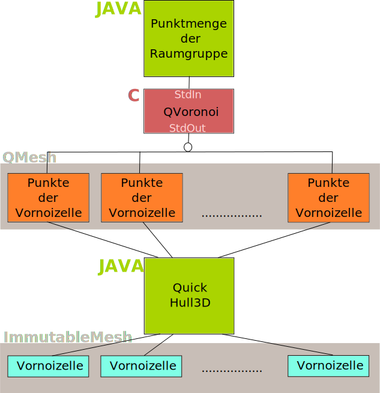

# Dokumentation 

## Kachelung des Raumes
#### Voronoi Tesselierung

Für die Berechnung der 3 dimensionalen Voronoi Zellen wurde von uns das Programm QHull gewählt. QHull ist ein in C geschriebenes Programm zum Berechnen von unter anderem Delaunay Triangulationen, konvexen Hüllen und Voronoi Diagrammen in n-Dimensionen.

Die Ausgabe von Qhull ist eine Menge von indexierten Vertices. Dazu erhält man eine Menge von Mengen welche die Indexe der einzelnen Voronoi Zellen enthalten.
Also 
	[[Indices der 1. Vornoi Zelle], [Indices der 2. Vornoi Zelle] ...]

#### Berechnung der konvexen Hülle mit QuickHull3D

Da die Ausgabe von Qhull eine Punktmenge liefert, müssen zum darstellen der Zellwände, nun die konvexe Hülle dieser berechnet werden.
Unsere Finale Lösung ist die Open Source Java Bibliothek QuickHull3D.
Die nun berechneten Zellen werden in dem Objekt "Immutable Mesh" verpackt und zum Darstellen weitergeschickt.

#### Probleme/Herausforderungen
Die erste Herrausforderung war eine geeignete Lösung zum berechnen des Voronoi Diagrammes zu finden. Erfolglos waren wir zu beginnt auf der suche nach einer Java Bibliothek, die dieser Aufgabe gewachsen ist.
Unsere engere Auswahl viel nach einiger Recherche auf PolyMake und Qhull. Polymake wurde schließlich aufgrund von Dependencies zu alten Pearl Versionen ausgesiebt. Qhull überzeugte uns da es gut dokumentiert und immer noch aktiv betreut wird. Dazu kam noch das z.B Matlab und Mathematica Qhull integriet haben, was wir als Indikator für Zuverlässigkeit und Korrektheit empfanden. Damit war unsere Entscheidung für die Voronoi Berechnung gefallen.

Für die Konvexe Hülle kam anfangs auch QHull bei uns auch zum Einsatz. Was sich zum Ende des Projektes, nach gründlicher Analyse, als schwerwiegender Flaschenhals heraus stellte. Die vielen Aufrufe des Programm für jede einzelne Zelle produzierten einen starken Overhead. Daraufhin wurde als alternative die Java Bibliothek QuickHull3d eingeführt. Eine Untersuchung durch einen Profiler ergab einen Performance Schub von ca. Faktor 100. 

#### Zusammenfassung

Wir sind mit der finalen Lösung der Berechnung zufrieden. Da wir für beide Teilprobleme gute Lösungen gefunden haben. Selbst eine Javaimplementierung der Voronoiberechnung würde nur einen geringen Geschwindigkeitsvorteil bringen da diese nur einmalig beim wechseln der Raumgruppe aufgerufen wird

#### Färbungsalgorithmus für äquivalente Zellwände

Die Anforderung an den Algorithmus bestand darin alle gleichen Facetten(Zellwände) mit einer eindeutigen Farbe zu versehen.
Der Farbbestimmung wurde mit Hilfe des folgenden Algorithmus implementiert:

* Sei **X** die Menge der Eckpunkte einer Facette
* Sei **H** ein Hashtable mit Schlüssel Farben zuweist  

* Berechne den Abstand von jedem Punkt zu jedem anderen Punkt
* summiere diese auf und speichere das Ergebnis in **Z**
* Prüfe Hashtable auch Eintrag **Z**
* Falls existent => gebe Farbe zurück
* Falls nicht existent => erzeuge neuen Eintrag für **Z** und generiere eine Zufallsfarbe die noch nicht existiert

#### Algorithmus zum Filtern entarteter Zellen

Die Anforderung an den Algorithmus bestand darin, Zellen welche am Rande der von QVoronoi berechneten Kachelung auszufiltern, da es bei diesen zu Verzerrungen kommt. Wir gehen davon aus, dass die im Zentrum liegende Zelle korrekt ist. Diese wir als Referenz für die anderen Zellen benutzt. In Pseudo Code:

* Sei **R** die Punktmenge der Zelle welche den Zentroid (Geometrischer Schwerpunkt) der kompletten Punktmenge enthält
* Sei **A** die Menge als korrekt angenommenen Zellen 
* füge **R** zu **A** hinzu
* Bilde den Zentroid von **R**
* Summiere den Abstand der Punkt von R zu seine Zentroid auf
* Speichere die Summe in **Z**
* Bilde nun von jeder anderen Zelle Zentroid
* Speichere für jede Zelle **x** den Abstand seiner Punkte zu seinem Zentroid in **Z_x**
* Für alle **Z_x** gleich **Z** => füge Zelle **x** zu **A** hinzu
* geben **A** zurück

**Anmerkung** : Der Algorithmus gibt keine perfekte Aussage darüber ob Zellen gleich sind. Aber im Rahmen unsere Anwendung lieferte er gute Ergebnisse.